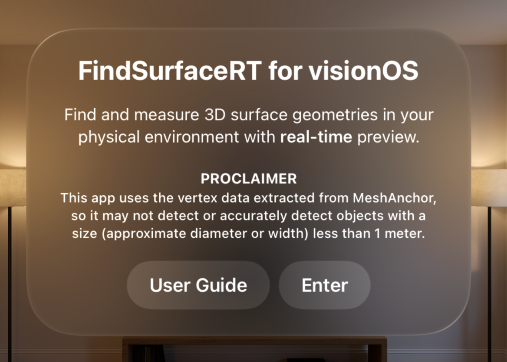
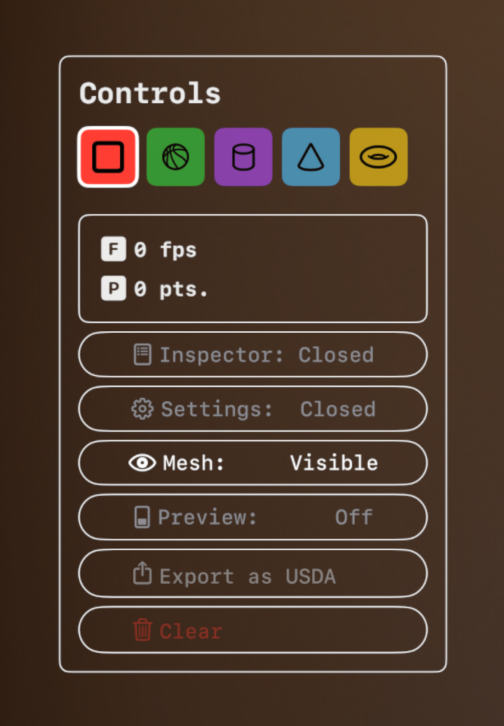

# FindSurface-RealityKit-visionOS-Response-to-Request

**Curv*Surf* FindSurface™ Response-to-Request demo app for visionOS (Swift)**

## Overview

This demo app demonstrates a sample project that searches vertex points (provided by ARKit as mesh anchors) for geometry shapes continuously fully utilizing features of [FindSurface-visionOS](https://github.com/CurvSurf/FindSurface-visionOS/tree/main) package.

This app introduces `Preview mode` that makes it continuously invoke FindSurface with a given frequency (90Hz as default) searching for geometry shapes from mesh points around the center of your sight. If found, it displays a 3D model of the detected shape transiently as a preview. Spatial tap will **capture** and **freeze** the previewed geometry.

As mentioned in [here](https://github.com/CurvSurf/FindSurface-visionOS#overview), FindSurface-visionOS limits the number of input points to less than 50k.

## Requirements

The app runs on an Apple Vision Pro (visionOS 1.2+) device only, and requires your permissions to track your hands and to scan your environment (world sensing) to operate as intended. Dialogs asking the permissions will be prompted upon launching the app.

## How to use

After launching the app, Startup window will open. Click on `Enter` button to open the immersive space.

The device will start scanning your physical environment and generate mesh anchors. A black sphere will float in front of you to indicate the center of your sight. Unlike [our previous app](https://github.com/CurvSurf/FindSurface-RealityKit-visionOS), which utilizes eye-tracking position, the seed point location is determined by ray casting with the device location and the direction of CoP (center of projection) in your sight in `Preview mode` of this app. This indicator helps you aim at the place to search for geometries in `Preview mode`.

### Startup window

- `User Guide` displays you this page (this README.md file) in the app, thanks to the [swift-markdown-ui package](https://github.com/gonzalezreal/swift-markdown-ui).
- `Enter` starts the immersive space.

### Controls Window

Controls window provides you with app controls that you will frequently access while using the app. It will be displayed on the right side of your sight and can be relocated by pinching with your middle finger and thumb of your right hand.

- Feature type picker: The five shape icons are the feature types that can be selected to search for using FindSurface.

- The sub-view right below the feature type picker is called [Status View](#status-view), which will be introduced in its own subsection below.

The toggle buttons, which will be described below, show the current state of the variable and toggles it when clicked:
- `Inspector` opens/closes the inspector window that provides a list of detected geometries and log messages that describes events occurred during the application's operation.
- `Settings` opens/closes the window where you can adjust FindSurface's parameters, the behaviors of the app and the preferences such as visual effects.
- `Mesh` enables/disables the user-interaction with the meshes. When the meshes occlude UI windows and interfere with the interaction, you can hide the meshes using this toggle and interact with the UI components or relocate the window somewhere else.
    > **Note**: while the meshes are disabled, any action that depends on the meshes (e.g., invoking FindSurface) will be disabled too until they are enabled again.
- `Preview` enables/disables `Preview mode`, which invocates FindSurface's detection feature with a given frequency (90Hz as default). While the preview mode is enabled, spatial taps on meshes capture the current preview geometry. Due to the limitation of FindSurface' implementation, any invocation (i.e., busy cases) that occurs before the previous invocation finishes, will be cancelled.
    > **Note**: The description above means, even if it is invocated with the frequency of 90Hz, the actual frequency of invocation can be less than 90Hz depending on the circumstances. However, according to our internal tests, the frequency of 'busy cases' remained in the single digits as an overall percentage when operating on a point cloud scale of less than 50,000 points which corresponds to a small room.

- `Export as USDA` exports all the captured geometries as a .usda file.
- `Clear` removes all the captured geometries. Before removing, a dialog will pop up to confirm that you want to remove all the geometries. While the dialog is present, Controls window will be disabled. If you tap places other than the windows, the dialog will be dismissed and Controls window will become enabled again.

#### Status View

- `F` and fps stand for 'found-per-second', which is calculated from the average of time-intervals between the events that FindSurface detects a geometry.
- `P` and pts mean the number of points that FindSurface receives as input, which are obtained from the surroundings of user.
- Fps graph: When `Preview mode` is enabled, the change of the fps will be plotted on the background of the status view (not included in the screenshot above).
    > **Note**: '**found-per-second**' means how frequently the information about geometries around you are provided, but doesn't mean any performance score such as frame-per-second of when talking about how well GPUs perform. Also note that the X-axis of Fps graph is not related to the time scale but rather just records changes in fps only when the events occur.

- This view is included in Controls window by default but you can change its location to stay in your sight or follow around the wrist of your left hand by using [Settings: Graphics & Rendering](#settings-graphics--rendering).

### Inspector Window

Inspector window shows you the information about geometries that you've found and the log messages about the events happened in the app. You can switch the tabs using the buttons on the ornament on the left side of the window.

See [this document](inspector-window.md) for details.

### Settings Window

Settings window allows you to change the settings of the app. There are three categories currently: `FindSurface`, `Behaviors` and `Graphics & Rendering`.

See [this document](settings-window.md) for details.
