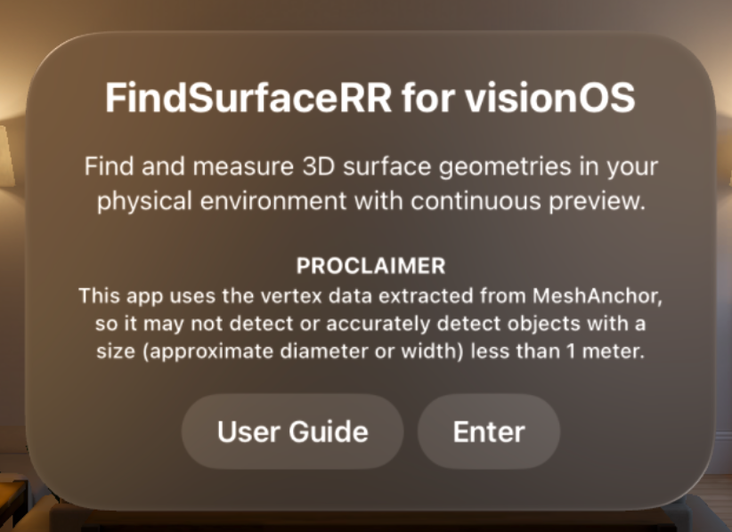
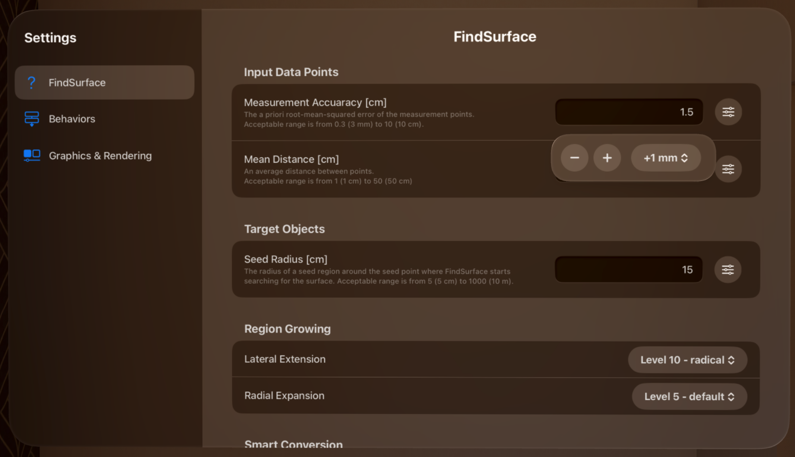

# FindSurface-RealityKit-visionOS-Response-to-Request

**Curv*Surf* FindSurface™ Response-to-Request demo app for visionOS (Swift)**

## Overview

This demo app demonstrates a sample project that searches vertex points (provided by ARKit as mesh anchors) for geometry shapes continuously fully utilizing features of [FindSurface-visionOS](https://github.com/CurvSurf/FindSurface-visionOS/tree/main) package.

This app introduces `Preview mode` that makes it continuously invoke FindSurface with a given frequency (90Hz as default) searching for geometry shapes from mesh points around the center of your sight. If found, it displays a 3D model of the detected shape transiently as a preview. Spatial tap will **capture** and **freeze** the previewed geometry.

As mentioned in [here](https://github.com/CurvSurf/FindSurface-visionOS#overview), FindSurface-visionOS limits the number of input points to less than 50k.

## Requirements

The app runs on an Apple Vision Pro (visionOS 1.2+) device only, and requires your permissions to track your hands and to scan your environment (world sensing) to operate as intended. Dialogs asking the permissions will be prompted upon launching the app.

## How to use

After launching the app, Startup window will open. Click on `Enter` button to open the immersive space.

The device will start scanning your physical environment and generate mesh anchors. A black sphere will float in front of you to indicate the center of your sight. Unlike [our previous app](https://github.com/CurvSurf/FindSurface-RealityKit-visionOS), which utilizes eye-tracking position, the seed point location is determined by ray casting with the device location and the direction of CoP (center of projection) in your sight in `Preview mode` of this app. This indicator helps you aim at the place to search for geometries in `Preview mode`.

### Startup window

- `User Guide` displays you this page (this README.md file) in the app, thanks to the [swift-markdown-ui package](https://github.com/gonzalezreal/swift-markdown-ui).
- `Enter` starts the immersive space.

### Controls Window

Controls window provides you with app controls that you will frequently access while using the app. It will be displayed on the right side of your sight and can be relocated by pinching with the middle finger and thumb of your right hand.

- Feature type picker: The five shape icons are the feature types that can be selected to search for using FindSurface.

- The sub-view right below the feature type picker is called [Status View](#status-view), which will be introduced in its own subsection below.

The toggle buttons, which will be described below, show the current state of the variable and toggles it when clicked:
- `Inspector` opens/closes the inspector window that provides a list of detected geometries and log messages that describes events occurred during the application's operation.
- `Settings` opens/closes the window where you can adjust FindSurface's parameters, the behaviors of the app and the preferences such as visual effects.
- `Mesh` enables/disables the user-interaction with the meshes. When the meshes occlude UI windows and interfere with the interaction, you can hide the meshes using this toggle and interact with the UI components or relocate the window somewhere else.
    > **Note**: while the meshes are disabled, any action that depends on the meshes (e.g., invoking FindSurface) will be disabled too until they are enabled again.
- `Preview` enables/disables `Preview mode`, which invocates FindSurface's detection feature with a given frequency (90Hz as default). While the preview mode is enabled, spatial taps on meshes capture the current preview geometry. Due to the limitation of FindSurface' implementation, any invocation (i.e., busy cases) that occurs before the previous invocation finishes, will be cancelled.
    > **Note**: The description above means, even if it is invocated with the frequency of 90Hz, the actual frequency of invocation can be less than 90Hz depending on the circumstances. However, according to our internal tests, the frequency of 'busy cases' remained in the single digits as an overall percentage when operating on a point cloud scale of less than 50,000 points which corresponds to a small room.

- `Export as USDA` exports all the captured geometries as a .usda file.
- `Clear` removes all the captured geometries. Before removing, a dialog will pop up to confirm that you want to remove all the geometries. While the dialog is present, Controls window will be disabled. If you tap places other than the windows, the dialog will be dismissed and Controls window will become enabled again.

#### Status View

- `F` and fps stand for 'found-per-second', which is calculated from the average of time-intervals between the events that FindSurface detects a geometry.
- `P` and pts mean the number of points that FindSurface receives as input, which are obtained from the surroundings of user.
- Fps graph: When `Preview mode` is enabled, the change of the fps will be plotted on the background of the status view (not included in the screenshot above).
    > **Note**: '**found-per-second**' means how frequently the information about geometries around you are provided, but doesn't mean any performance score such as frame-per-second of when talking about how well GPUs perform. Also note that the X-axis of Fps graph is not related to the time scale but rather just records changes in fps only when the events occur.

- This view is included in Controls window by default but you can change its location to stay in your sight or follow around the wrist of your left hand by using [Settings: Graphics & Rendering](#settings-graphics--rendering).

### Inspector Window

Inspector window shows you the information about geometries that you've found and the log messages about the events occurred in the app. You can switch the tabs using the buttons on the ornament on the left side of the window.

On `Geometries` tab, you'll see the list of detected geometries. Each item shows the name and the summary of the geometry it represents.
- Clicking on the item will expand the panel showing the detailed description of the geometry.
- Long-clicking (pinching and holding) will reveal the delete button allowing to remove the geometry individually.
- The button on the top right corner (with the trash bin icon) removes all the geometries at once, after showing a confirmation dialog.

On `Logs` tab, you'll see the log messages that are generated by the app while detecting geometries and exporting them as .usda files.
- The button on the top right corner (with the trash bin icon) removes all the log messages at once, after showing a confirmation dialog.

### Settings Window

Settings window allows you to change the settings of the app. There are three categories currently: `FindSurface`, `Behaviors` and `Graphics & Rendering`.

For convenience, there are buttons on the right end of text fields that handle numbers, providing a stepper with appropriate step values or slider if the value has to be bounded to a certain range (for example, see the image on the [Settings: FindSurface](#settings-findsurface) below).

#### Settings: FindSurface

On `FindSurface` tab, you can adjust the parameters of FindSurface. For the meanings and usages of the parameters, refer to [Here](https://github.com/CurvSurf/FindSurface?tab=readme-ov-file#how-does-it-work).

- `Measurement Accuracy` means the *a priori* root-mean-squared error of the measurement points. Acceptable range is from 0.3 (3mm) to 10 (10cm).

- `Mean Distance` means an average distance between points. Acceptable range is from 1 (1cm) to 50 (50cm).

    > **Note**: In `visionOS`, due to the fact that the only option available to obtain depth data is vertex points of the mesh anchors, `Measurement Accuracy` and `Mean Distance` are virtually fixed. Thus, they are initially set to [the optimal values](https://github.com/CurvSurf/FindSurface-visionOS#optimal-parameter-set-for-apple-vision-pro) that we have found after tested on various circumstances. You might not need to change them in most cases.

- `Seed Radius` means the radius of a seed region around the seed point where FindSurface starts searching for the surface. Acceptable range is from 5 (5 cm) to 1000 (10 m). This parameter should be set to an appropriate value depending on the approximate size of the target object. For convenience, you can adjust this parameter by the magnification gesture (pinching with the index finger and thumb of both hands and moving apart or closer.)

- `Lateral Extension` means the tendency for the algorithm to spread its search space in lateral (tangential) direction of the surface to be detected or measured.

- `Radial Expansion` means the tendency for the algorithm to thicken/thin its search space in normal direction of the surface to be detected or measured.

- `Show prompt dialog for Smart Conversion`: If this option is enabled, asks whether to convert found geometries according to the conversion options. Otherwise, it applies the conversion automatically without asking if the corresponding options are set. See [here](https://github.com/CurvSurf/FindSurface?tab=readme-ov-file#smart-conversion) for details on Smart Conversion.
    - `Cone to Cylinder` allows `cylinder` as a result when target feature is set to `cone`, if enabled.
    - `Torus to Cylinder` allows `cylinder` as a result when target feature is set to `torus`, if enabled.
    - `Torus to Sphere` allows `sphere` as a result when target feature is set to `torus`, if enabled.

- `Allow Auto (Any) Feature Type`: If this option is enabled, `Auto` option is added to the Controls window, which allows to automatically detect the appropriate geometry without specifying a feature type in advance. This feature is disabled by default because it cannot operate correctly with the limited data available in `visionOS` (i.e., vertex points from ARKit MeshAnchor.) See [here](https://github.com/CurvSurf/FindSurface?tab=readme-ov-file#auto-detection) for details on Auto Detection.

#### Settings: Behaviors

On `Behaviors` tab, options that can change the app's behavior are listed.

- `Complete partial torus` and `Threshold [°]` convert the torus segment into a full torus when the angle exceeds a threshold. The threshold is set to 270° by default and any torus segments having the tube angle of more than 270° will be converted to a full torus.

- `Cap conical frustum` and `Threshold [%]` convert the conical frustum into a cone by adding a vertex point if the ratio of the top radius to the bottom radius is less than a threshold. The threshold is set to 10% by default and any conical frustums having the top radius/bottom radius ratio less than 10% will be converted to a cone.

- `Adjust Device Anchor direction`: Lower the center-of-sight indicator (the black sphere) on the screen.
    > **Note**: While testing our app, we realized that when wearing the Apple Vision Pro, looking directly at the center of the sight (toward the negative Z axis of DeviceAnchor's `originFromAnchorTransform`) can cause eye strain by making users raise their eyes, despite individual differences. Considering advice from ISO ergonomics standards 9241-5, which recommend a -35° from the rest angle, we have added an option to adjust this direction from 0° to 25° downward.

- `Preview Invocation Frequency` adjusts the invocation frequency of FindSurface's `Preview mode`. This means the app tries detecting the geometry in the given `sampling-per-second`.

- `Targeting method in Off-line mode` determines how to pick the seed point location when you spatial tap when `Preview mode` is disabled. `Device` means it will perform exactly the same way of `Preview mode`. `User` means it will perform exactly the same way as [FindSurface-RealityKit-visionOS](https://github.com/CurvSurf/FindSurface-RealityKit-visionOS#findsurface-realitykit-visionos) app does (i.e., where the user stares). `None` means it will ignore the gesture.

#### Settings: Graphics & Rendering

On `Graphics & Rendering` tab, you can adjust the following settings:

- `Show animation effect for mesh updates` shows an animation effect that spreads white flash on the meshes when they updates.
    > **⚠️ WARNING**: This option is debug purpose only and may trigger seizures for people with photosensitive epilepsy.

- `Show geometry outline` determines whether to show outlines of geometries.

- `Show inlier points` determines whether to show inlier points. This option significantly impacts performance. If there are many geometries in the scene or if a geometry having many inlier points is detected, app performance may slow down. In such cases, please disable this option.

- `Enable Hand Joints Entities` renders cube entities representing each of joints on your hand. This option is debug purpose only to check if hand anchor is correctly tracked.

- `Visible Hand` determines which hand is to be rendered by the option above.

- `Status View Position`: This option allows you to move the status view (displays fps and the number of points) to the following positions with user-defined offset:
    - `Control`: The status view is displayed in Control window. (default)
    - `Device`: The status view is displayed near the center of your sight with user-defined offset.
    - `Wrist (Left Hand)`: The status view is displayed near your wrist of left hand with user-defined offset.

- `Reset to default values` resets the user-defined offset for the position of the status view to a recommended preset values for both `Device` and `Wrist (Left Hand)`. The preset values of offsets are: (15, -4, 3) and (0, 10, 0) respectively.

- `Show Axis Indicator (Left hand wrist)`: This option is only displayed when `Status View Position` is set to `Wrist (Left Hand)`. When enabled, a coordinate axis indicator pointing the direction of each offset (X, Y, Z), as described below, will appear above your left wrist.

- `Wrist Anchor Offset X` moves the `Status View` in the direction of the thumb or the opposite direction.
- `Wrist Anchor Offset Y` moves the `Status View` vertically, perpendicular to the back of the hand.
- `Wrist Anchor Offset Z` moves the `Status View` along the central axis of the wrist.

- `Device Anchor Offset X` moves the `Status View` horizontally.
- `Device Anchor Offset Y` moves the `Status View` vertically.
- `Device Anchor Offset Z` moves the `Status View` back and forth.
