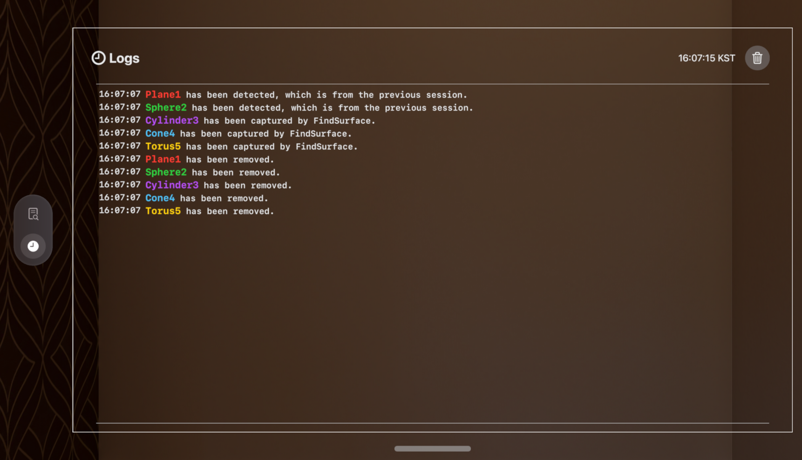

# FindSurface-RealityKit-visionOS-Response-to-Request

**Curv*Surf* FindSurface™ Response-to-Request demo app for visionOS (Swift)**

## Inspector Window

Inspector window shows you the information about geometries that you've found and the log messages about the events happened in the app. You can switch the tabs using the buttons on the ornament on the left side of the window.

On `Geometries` tab, you'll see the list of detected geometries. Each item shows the name and the summary of the geometry it represents.
- Clicking on the item will expand the panel showing the detailed description of the geometry.
- Long-clicking (pinching and holding) will reveal the delete button allowing to remove the geometry separately.
- The button on the top right corner (with the trash bin icon) removes all the geometries at once, after showing a confirmation dialog.

On `Logs` tab, you'll see the log messages that are generated by the app while detecting geometries and exporting them as .usda files.
- The button on the top right corner (with the trash bin icon) removes all the log messages at once, after showing a confirmation dialog.

Click [README.md](README.md#inspector-window) to go back.