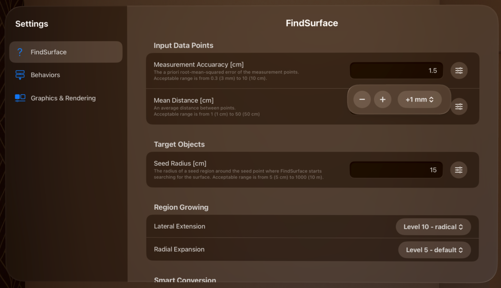
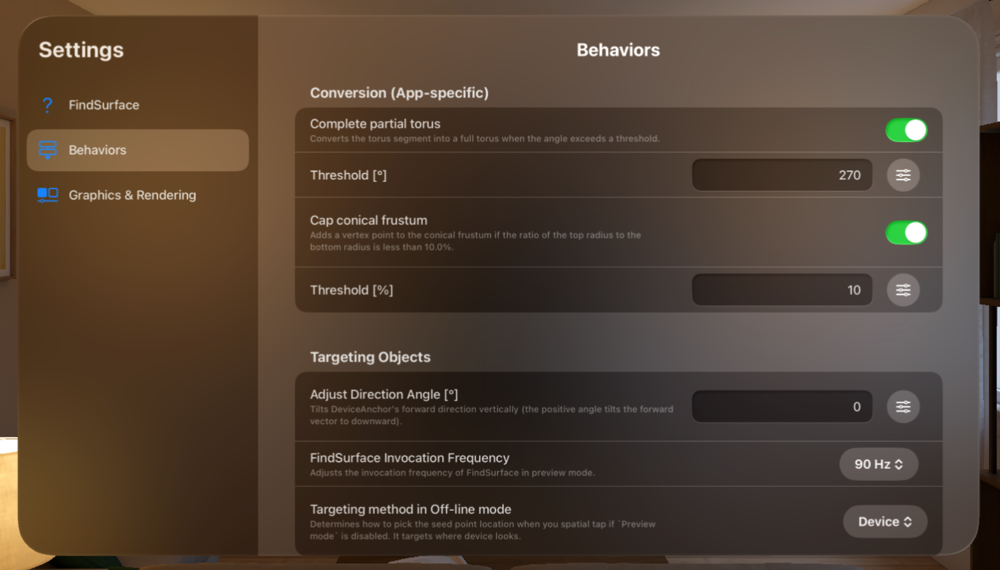
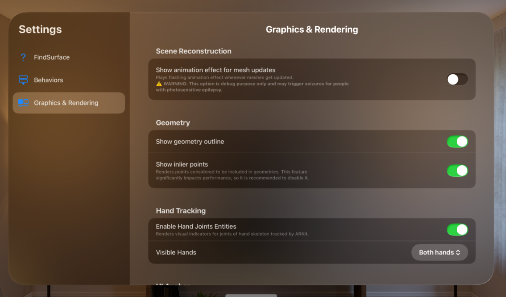

# FindSurface-RealityKit-visionOS-Response-to-Request

**Curv*Surf* FindSurface™ Response-to-Request demo app for visionOS (Swift)**

## Settings Window

Settings window allows you to change the settings of the app. There are three categories currently: `FindSurface`, `Behaviors` and `Graphics & Rendering`.

For convenience, there are buttons on the right end of text fields that handle numbers, providing a stepper with appropriate step values or slider if the value has to be bounded to a certain range (for example, see the image on the [Settings: FindSurface](#settings-findsurface) below).

### Settings: FindSurface

On `FindSurface` tab, you can adjust the parameters of FindSurface. For the meanings and usages of the parameters, refer to [Here](https://github.com/CurvSurf/FindSurface?tab=readme-ov-file#how-does-it-work).

- `Measurement Accuracy` means the *a priori* root-mean-squared error of the measurement points. Acceptable range is from 0.3 (3mm) to 10 (10cm).

- `Mean Distance` means an average distance between points. Acceptable range is from 1 (1cm) to 50 (50cm).

    > **Note**: In `visionOS`, due to the fact that the only option available to obtain depth data is vertex points of the mesh anchors, `Measurement Accuracy` and `Mean Distance` are virtually fixed. Thus, they are initially set to [the optimal values](https://github.com/CurvSurf/FindSurface-visionOS#optimal-parameter-set-for-apple-vision-pro) that we have found after tested on various circumstances. You might not need to change them in most cases.

- `Seed Radius` means the radius of a seed region around the seed point where FindSurface starts searching for the surface. Acceptable range is from 1 (1 cm) to 1000 (10 m). This parameter should be set to an appropriate value depending on the approximate size of the target object. For convenience, you can adjust this parameter by the magnification gesture (pinching with the index finger and thumb of both hands and moving apart or closer.)

- `Lateral Extension` means the tendency for the algorithm to spread its search space in lateral (tangential) direction of the surface to be detected or measured.

- `Radial Expansion` means the tendency for the algorithm to thicken/thin its search space in normal direction of the surface to be detected or measured.

- `Show prompt dialog for Smart Conversion`: If this option is enabled, asks whether to convert found geometries according to the conversion options. Otherwise, it applies the conversion automatically without asking if the corresponding options are set. See [here](https://github.com/CurvSurf/FindSurface?tab=readme-ov-file#smart-conversion) for details on Smart Conversion.
    - `Cone to Cylinder` allows `cylinder` as a result when target feature is set to `cone`, if enabled.
    - `Torus to Cylinder` allows `cylinder` as a result when target feature is set to `torus`, if enabled.
    - `Torus to Sphere` allows `sphere` as a result when target feature is set to `torus`, if enabled.

- `Allow Auto (Any) Feature Type`: If this option is enabled, `Auto` option is added to the Controls window, which allows to automatically detect the appropriate geometry without specifying a feature type in advance. This feature is disabled by default because it cannot operate correctly with the limited data available in `visionOS` (i.e., vertex points from ARKit MeshAnchor.) See [here](https://github.com/CurvSurf/FindSurface?tab=readme-ov-file#auto-detection) for details on Auto Detection.

### Settings: Behaviors

On `Behaviors` tab, options that can change the app's behavior are listed.

- `Complete partial torus` and `Threshold [°]` convert the torus segment into a full torus when the angle exceeds a threshold. The threshold is set to 270° by default and any torus segments having the tube angle of more than 270° will be converted to a full torus.

- `Cap conical frustum` and `Threshold [percentage]` convert the conical frustum into a cone by adding a vertex point if the ratio of the top radius to the bottom radius is less than a threshold. The threshold is set to 10% by default and any conical frustums having the top radius/bottom radius ratio less than 10% will be converted to a cone.

- `Adjust Device Anchor direction`: Lower the center-of-sight indicator (the black sphere) on the screen.
    > **Note**: While testing our app, we realized that when wearing the Apple Vision Pro, looking directly at the center of the sight (toward the negative Z axis of DeviceAnchor's `originFromAnchorTransform`) can cause eye strain by making users raise their eyes, despite individual differences. Considering advice from ISO ergonomics standards 9241-5, which recommend a -35° from the rest angle, we have added an option to adjust this direction from 0° to 25° downward.

- `Preview Invocation Frequency` adjusts the invocation frequency of FindSurface's `Preview mode`. This means the app tries detecting the geometry in the given `sampling-per-second`.

- `Targeting method in Off-line mode` determines how to pick the seed point location when you spatial tap when `Preview mode` is disabled. `Device` means it will perform exactly the same way of `Preview mode`. `User` means it will perform exactly the same way as [FindSurface-RealityKit-visionOS](https://github.com/CurvSurf/FindSurface-RealityKit-visionOS#findsurface-realitykit-visionos) app does (i.e., where the user stares). `None` means it will ignore the gesture.

### Settings: Graphics & Rendering

On `Graphics & Rendering` tab, you can adjust the following settings:

- `Show animation effect for mesh updates` shows an animation effect that spreads white flash on the meshes when they updates.
    > **⚠️ WARNING**: This option is debug purpose only and may trigger seizures for people with photosensitive epilepsy.

- `Show geometry outline` determines whether to show outlines of geometries.

- `Show inlier points` determines whether to show inlier points. This option significantly impacts performance. If there are many geometries in the scene or if a geometry having many inlier points is detected, app performance may slow down. In such cases, please disable this option.

- `Enable Hand Joints Entities` renders cube entities representing each of joints on your hand. This option is debug purpose only to check if hand anchor is correctly tracked.

- `Visible Hand` determines which hand is to be rendered by the option above.

- `Status View Position`: This option allows you to move the status view (displays fps and the number of points) to the following positions with user-defined offset:
    - `Control`: The status view is displayed in Control window. (default)
    - `Device`: The status view is displayed near the center of your sight with user-defined offset.
    - `Wrist (Left Hand)`: The status view is displayed near your wrist of left hand with user-defined offset.

- `Reset to default values` resets the user-defined offset for the position of the status view to a recommended preset values for both `Device` and `Wrist (Left Hand)`. The preset values of offsets are: (15, -4, 3) and (0, 10, 0) respectively.

- `Show Axis Indicator (Left hand wrist)`: This option is only displayed when `Status View Position` is set to `Wrist (Left Hand)`. When enabled, a coordinate axis indicator pointing the direction of each offset (X, Y, Z), as described below, will appear above your left wrist.

- `Wrist Anchor Offset X` moves the `Status View` in the direction of the thumb or the opposite direction.
- `Wrist Anchor Offset Y` moves the `Status View` vertically, perpendicular to the back of the hand.
- `Wrist Anchor Offset Z` moves the `Status View` along the central axis of the wrist.

- `Device Anchor Offset X` moves the `Status View` horizontally.
- `Device Anchor Offset Y` moves the `Status View` vertically.
- `Device Anchor Offset Z` moves the `Status View` back and forth.

Click [README.md](README.md#settings-window) to go back.